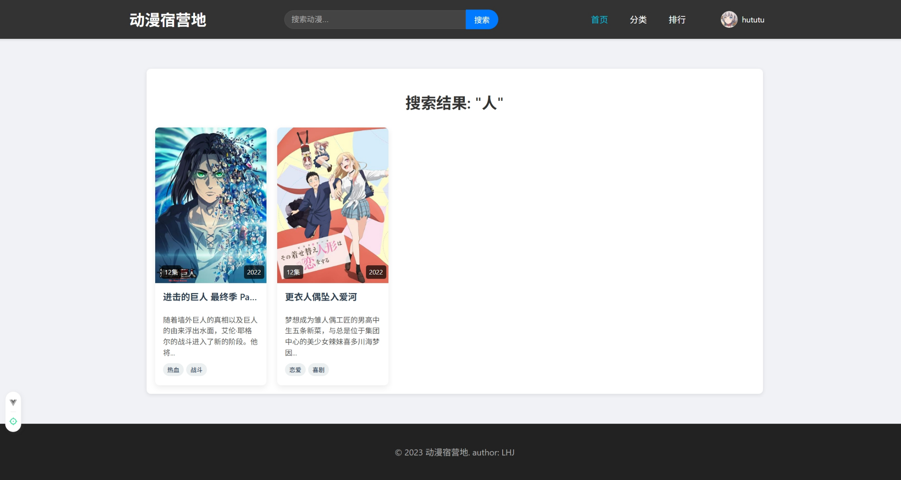

# 项目名
## 动漫宿营地

### 介绍

&ensp; **大学前端课程的一份结课作业**   
&ensp; **一个简单的网页，利用vue3完成，pinia进行状态管理，实现了登录、注册、收藏、评论等功能**  
&ensp; **不得不感叹 AI属实是很厉害啊**  

### 致谢

&ensp; **Gemini 2.5Pro Preview  0506**  
&ensp; **Gemini 2.5Flash Preview  0520**  
&ensp; **trae**  
  
--------------------------

## 首页效果

## 动漫详情页

## 动漫分类

## 个人首页及其收藏

## 排行页

## 搜索页
